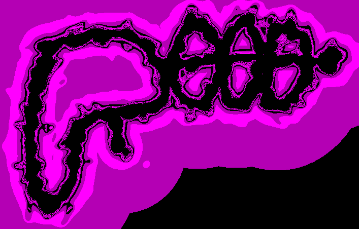

# fractalinator

This repository contains Python code for texturing words and simple drawings like a Mandelbrot fractal. 

## Overview

The above image started as a simple doodle of a Dr. Doofenshmirtz-style ray gun, until it was *fractalinated!* To fractalinate your own drawing, follow the steps below:
1. Clone this repository: ```git clone https://github.com/fcseidl/fractalinator.git```
2. Make sure you have the dependencies listed below.
3. Screenshot the words or picture you wish to fractalinate, and save the screenshot as a ```.png``` file in your newly cloned ```fractalinator``` directory.
4. Run the main script, e.g. ```python fractalinator.py -i input.png -r 200 -c wolverine```. This will create a matplotlib popup window displaying a newly created fractalination of your image. If you like it, you can save the image directly out of matplotlib. If you want to cut the border around your image, pass the additional argument ```-o outfile.png``` to save the image properly in ```.png``` format after you close the popup.

If you don't love the first image you create, the main script takes quite a few command line arguments (documented below) which can be tweaked to alter it. If you'd like even more control, you can run commands in a Python terminal, or even write a custom driver to replace ```fractalinator.py```! For this, it might be useful to refer to the docstrings of the public classes and functions.

**Pro tip:** turn the resolution down when experimenting with the arguments, as the unoptimized code may take a minute or so to create a high-resolution image. After you find the settings you like, run the program again with a higher resolution, and pass it an outfile name to save your creation!

## Dependencies
Note that versions other than those listed here probably work but have not been tested. This code was written for Python 3.7.4, with several libraries:

```numpy==1.21.6```

```perlin-noise==1.12```

```Pillow==9.4.0```

```scikit-learn==1.0.2```

```matplotlib==3.5.3```


## Command line arguments

```-h/--help``` refers you to this README.

```-i/-infile``` is used to specify that the next argument is the name of a ```.png``` image to fractalinate.

```-o/--outfile``` is used to specify that the next argument is the name of a file to store the fractalized image.

```-c/--coloring``` is used to specify that the next argument is a color cycle to be used for the lemniscates surrounding the fractalinated curves. The image above illustrates the default setting, but there are others: 'wolverine', 'midnight', 'valentine', 'zebra', and 'rainbow'. Play with them to see what you like!

```-n/--inverted``` tells the program to invert the colors in the infile image before processing.

```-r/--resolution``` is used to specify that the next argument is an integer which will control the resolution of the image. Using ```-r 50``` results in a pretty grainy image, while ```-r 300``` is quite crisp. The default is 200; this is the resolution of the image above.

```-s/--smoothness``` is used to specify that the next argument is a scalar value. Larger values tend to shrink jagged protrusions on the edges of your fractalinated lines. The default is 0.6.

```-t/--tightness``` is used to specify that the next argument is another scalar value. Larger values tend to pull the fractalinated curve more closely around the original curve. The default is 5.0.

```-d/--seed``` is used to specify that the next argument is a positive integer random seed. Changing this value gives you different fractalinations of the same image.

```-v/--octaves``` is used to specify that the next argument is a scalar value passed to a Perlin noise instance. Generally, smaller values induce more order in the resulting image. The default is 5.0.


