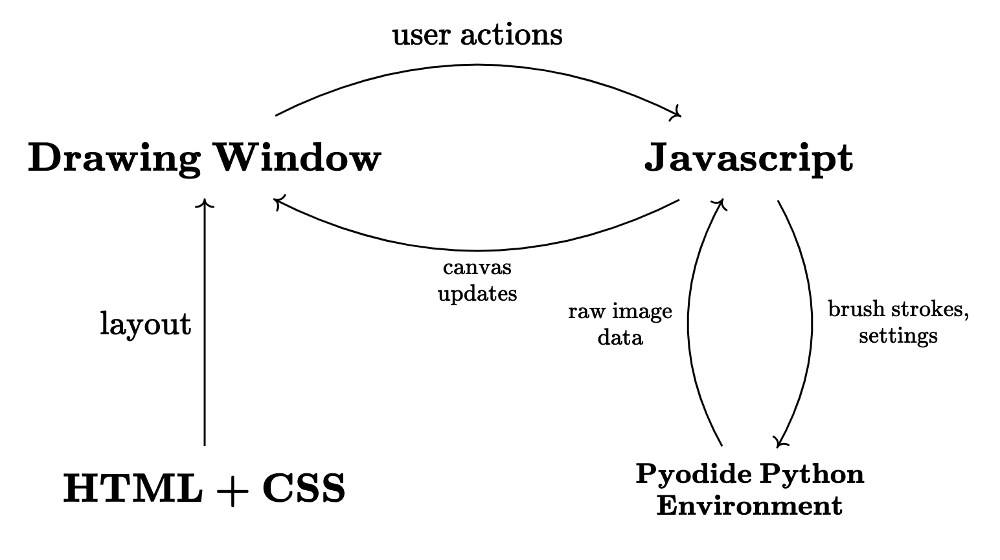
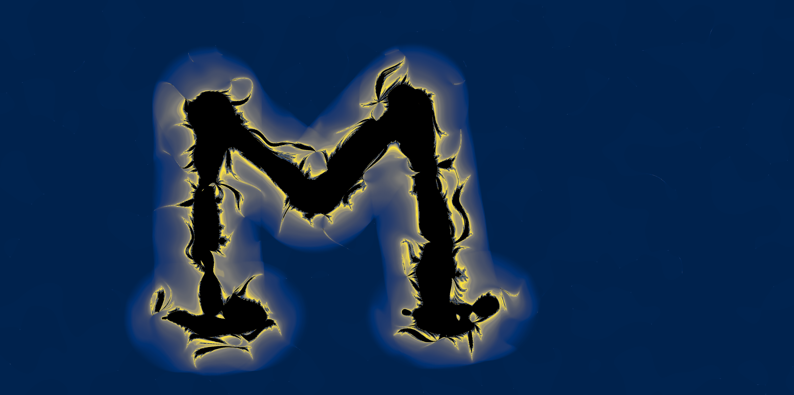

UPDATES:

8/25 I gave a talk on the fractalinator's web deployment for the Puget Sound Programming Python (PuPPy) user group. See it on [YouTube](https://www.youtube.com/watch?v=DaZUcxD6iJc)!

10/25 The algorithm used to create random noise to texture the fractalinations is now distrubuted as a separate package, which can be installed from PyPI. It's source repo is https://github.com/fcseidl/convolved-noise.

# Fractalinator

This repo holds the source code for a digital art demo I created and deployed as a single-page web application. To use the app to make your own art, click [here](https://fcseidl.github.io/fractalinator/). Read on to learn more about the idea and its implementation.

This is an drawing app which lets you draw a [multibrot](https://en.wikipedia.org/wiki/Multibrot_set)-like fractal in any shape that you choose! The video below shows an example. I tried to evoke a saguaro cactus. A few more example fractalinations are at the bottom of this README.


https://github.com/user-attachments/assets/bca13855-29b0-4c92-9ce6-bf94ea0d238d


## Web application
Your browser runs the fractalinator app using the four files in the ```/docs``` folder. Three of these are the usual `index.html`, with a CSS stylesheet, and a javascript to handle the interactivity. The fourth is a wheel for the ```fractalinator``` Python package, built from source code in this repository. This package controls the fractal image, performing numerical computation which would be slow and cumbersome in Javascript. Python methods are called from Javascript using [pyodide](https://pyodide.org/en/stable/index.html), a WASM Python interpreter.




## Python package
You can also install the `fractalinator` package to your Python environment using 
```
pip install git+https://github.com/fcseidl/fractalinator/
```
You can run the `demo.py` module to open a fractalinator canvas in a Tkinter widget, outside the browser.

## Is the name a *Phineas and Ferb* reference?
Yes. Yes it is.

## Lagoon
The waves are achieved by setting ```bailout_radius=2.0```.


## Flames
Here, I drew in the negative space rather than the positive.


## Ghost
From 10/24. Happy Halloween!


## Saguaro
Here's the cactus drawing from the video, in higher resolution.


## M
Go Blue!


