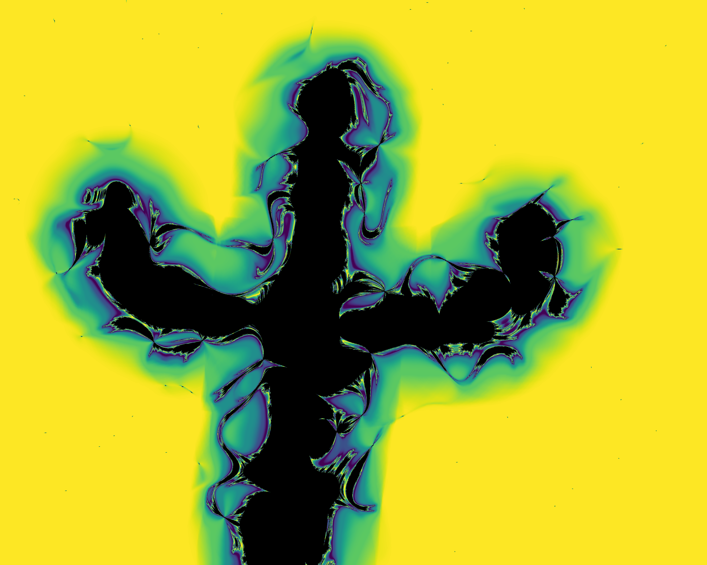

# Fractalinator

This is an drawing app which lets you draw a multibrot-like fractal in any shape that you choose! For instance, I drew the first image below in a pop-up 
window opened by the following simple program. I tried to evoke a saguaro cactus. A few more example fractalinations are at the bottom of this README.
```
from artwork import Artwork
Artwork(cmap_name='viridis_r')
```


## Dependencies
To make Fractalinator easy to play with, it has few dependencies. If you use Python, ```tkinter``` is probably installed by default.
| Library    | Tested Version |
| -------- | ------- |
| numpy  | 2.1.0    |
| matplotlib | 3.9.2     |
| tkinter | 8.6 |

## Usage
Fractalinator drawing windows are managed by the ```Artwork``` class in the ```artwork``` module. To make a fractalination, simply construct an ```Artwork``` object. 
Calling ```Artwork()``` will open a drawing window with the default settings. To save your drawing, press the 1 key while in the drawing window. 
Your art will be saved to a file named ```fractalination-[n].png```. Other number keys (2-9) behave similarly, but save a more detailed image with the resolution 
increased multiplied by the number on the key.

The default settings can be changed with a number of keyword arguments. Mostly notably, the ```cmap_name``` argument allows you to choose any [matplotlib colormap](https://matplotlib.org/stable/gallery/color/colormap_reference.html). The full set of keyword arguments is described below.
| **Name** | **Default** | **Description** |
| -------- | ----------- | --------------- |
| ```bailout_radius``` | ```3``` | Escape threshold for iterative fractal generation. Values near or below 2 may allow the noise field to affect the background image. |
| ```brush_strength``` | ```50``` | Larger values give thicker strokes. |
| ```brush_radius``` | ```100``` | May need to be increased to avoid choppy images with higher brush strength. Larger values slow drawing. |
| ```cmap_name``` | 'gray_r' | ```matplotlib``` colormap name to use in image. |
| ```cmap_period``` | ```4``` | Smaller values make the colormap repeat more frequently around the outside of the fractal.|
| ```max_it``` | ```30``` | Maximum iteration count for iterative fractal generation. Smaller values speed computation but reduce image quality. |
| ```noise_seed``` | ```None``` | If positive integer, random seed for reproducible noise. |
| ```noise_sig``` | ```26``` | Smaller values result in more, smaller features in the image. |
| ```power``` | ```3``` | Multibrot fractal order. Must be a positive integer. |
| ```shape``` | ```(720, 576)``` | (width, height) of drawing window in pixels. Note that large windows may exhibit perceptible lag when drawing. |
| ```thin_it``` | ```5``` | Only iterate pixels to max_it if they are not diverged by this iteration, saving computation costs. |

## Is the name a *Phineas and Ferb* reference?
Yes, yes it is.

## Lagoon
The waves are achieved by setting ```bailout_radius=2```.


## Flames
Here, I drew in the negative space rather than the positive.


## Ghost
Happy October.


