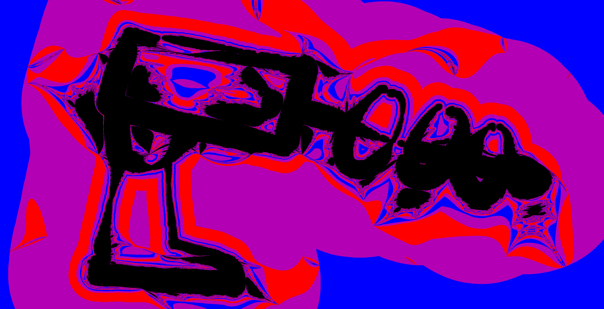
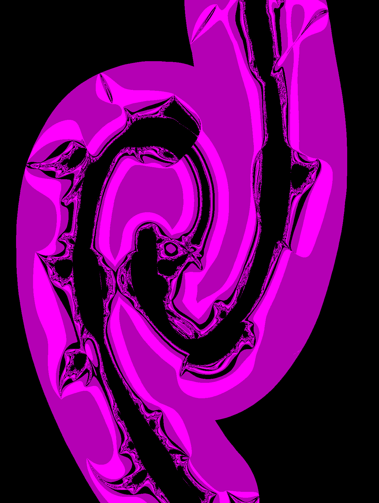
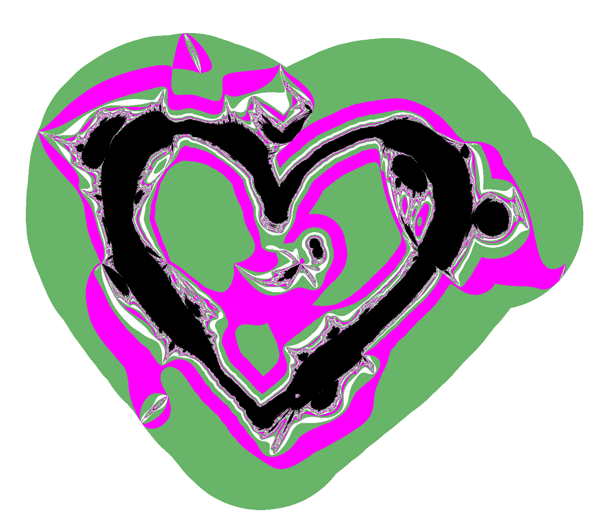
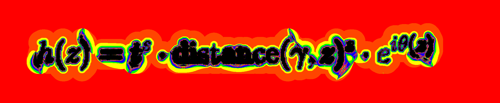

# fractalinator

This repository contains Python code for texturing words and simple drawings like a Mandelbrot fractal. The image above is one example; scroll down to the Gallery section to see a few more examples!

## Overview

The above image started as a simple doodle of a Dr. Doofenshmirtz-style ray gun, until it was *fractalinated!* More similar images are at the bottom of this README! To fractalinate your own drawing, follow the steps below:
1. Clone this repository: ```git clone https://github.com/fcseidl/fractalinator.git```
2. Make sure you have the dependencies listed below.
3. Screenshot the words or picture you wish to fractalinate, and save the screenshot as a ```.png``` file in your newly cloned ```fractalinator``` directory.
4. Run the main script, e.g. ```python fractalinator.py -i input.png -r 200 -c wolverine```. This will create a matplotlib popup window displaying a newly created fractalination of your image. If you like it, you can save the image directly out of matplotlib. If you want to cut the border around your image, pass the additional argument ```-o outfile.png``` to save the image properly in ```.png``` format after you close the popup.

If you don't love the first image you create, the main script takes quite a few command line arguments (documented below) which can be tweaked to alter it. If you'd like even more control, you can run commands in a Python terminal, or even write a custom driver to replace ```fractalinator.py```! For this, it might be useful to refer to the docstrings of the public classes and functions.

**Pro tip:** turn the resolution down when experimenting with the arguments, as the unoptimized code may take a minute or so to create a high-resolution image. After you find the settings you like, run the program again with a higher resolution, and pass it an outfile name to save your creation!

## Dependencies
Note that versions other than those listed here probably work but have not been tested. This code was written for Python 3.7.4, with several libraries:

```numpy==1.21.6```

```perlin-noise==1.12```

```Pillow==9.4.0```

```scikit-learn==1.0.2```

```matplotlib==3.5.3```


## Command line arguments

```-h/--help``` refers you to this README.

```-i/-infile``` is used to specify that the next argument is the name of a ```.png``` image to fractalinate.

```-o/--outfile``` is used to specify that the next argument is the name of a file to store the fractalized image.

```-c/--coloring``` is used to specify that the next argument is a color cycle to be used for the lemniscates surrounding the fractalinated curves. The image above illustrates the default setting, but there are others: 'wolverine', 'midnight', 'valentine', 'zebra', and 'rainbow'. Play with them to see what you like!

```-n/--inverted``` tells the program to invert the colors in the infile image before processing.

```-r/--resolution``` is used to specify that the next argument is an integer which will control the resolution of the image. Using ```-r 50``` results in a pretty grainy image, while ```-r 400``` is quite crisp. The default is 200.

```-s/--smoothness``` is used to specify that the next argument is a scalar value. Larger values tend to shrink jagged protrusions on the edges of your fractalinated lines. The default is 0.6.

```-t/--tightness``` is used to specify that the next argument is another scalar value. Larger values tend to pull the fractalinated curve more closely around the original curve. The default is 7.0.

```-d/--seed``` is used to specify that the next argument is a positive integer random seed. Changing this value gives you different fractalinations of the same image. The default is 1.

```-v/--octaves``` is used to specify that the next argument is a scalar value passed to a Perlin noise instance. Generally, smaller values induce more order in the resulting image. The default is 1.5.


## How does the math work?
Mandelbrot fractal images are defined by coloring points in the complex plane according to how long it takes them to diverge when a quadratic function is applied repeatedly. The origin $0 + 0i$ is in the center of the image, and all of the visually interesting points are inside the circle $|z|=2$. Think of a Mandelbrot image as a function from $\mathbb{C}$ into RGB space. In other words, when you look at a Mandelbrot image, what you are seeing is a window of the complex plane colored by $$z \mapsto \text{mandelbrot}(z).$$

To fractalinate a doodle we draw, imagine embedding that doodle as a curve $\gamma$ in the complex plane. We want a different function from $\mathbb{C}$ into RGB space, one which looks interesting near $\gamma$ instead of near the origin. To keep a fractal boundary, that function should have the form $$z \mapsto \text{mandelbrot}(h(z)).$$ Because the Mandelbrot function looks most interesting for small values of $z$, our transform $h(z)$ should assign small values near our curve $\gamma$. Because the contours of $h(z)$ will emanate from $\gamma$, I call $h(z)$ a "halo".

The specific halo used by the fractalinator has the form $$h(z) = t^s \cdot \text{distance}(\gamma, z)^s \cdot e^{i\theta(z)}.$$ Multiplying by a power of the distance from the curve has the desired effect of assigning small $h(z)$ values near $\gamma$. Here $s$ and $t$ are the smoothness and tightness parameters controllable from the command line. They serve to tune the general fit of the resulting fractalination. Finally, $e^{i\theta(z)}$ is a randomly generated smooth field of complex units, which fan $h(z)$ out to nonzero angles in the complex plane. Without this term, the boundary of the fractalinated curve would be smooth and boring. With it, the fractalinated image is *locally diffeomorphic* to a Mandelbrot image. That is, if you zoom in far enough (almost) anywhere at high enough resolution, it will look as if you zoomed in on the Mandelbrot set. Try it!


## Gallery







