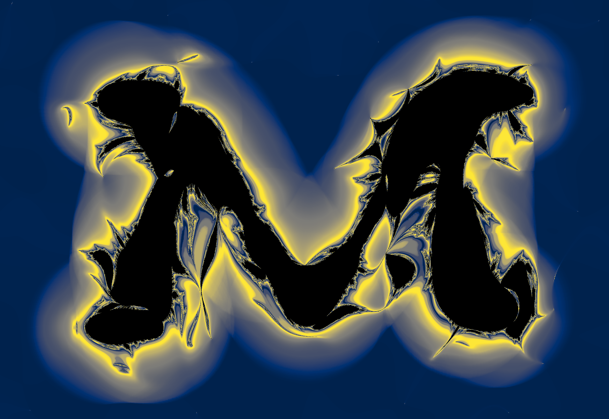

UPDATES:

10/25 The web app now supports touch screens!

10/25 The algorithm used to create random noise to texture the fractalinations is now distrubuted as a separate package, which can be installed from PyPI. It's source repo is https://github.com/fcseidl/convolved-noise.

8/25 I gave a talk on the fractalinator's web deployment for the Puget Sound Programming Python (PuPPy) user group. See it on [YouTube](https://www.youtube.com/watch?v=DaZUcxD6iJc)!

# Fractalinator

This repo holds the source code for a digital art demo I created and deployed as a single-page web application. To use the app to make your own art, click [here](https://fcseidl.github.io/fractalinator/). Read on to learn more about the idea and its implementation.

This is an drawing app which lets you draw a [multibrot](https://en.wikipedia.org/wiki/Multibrot_set)-like fractal in any shape that you choose! The video below shows an example. I tried to evoke a saguaro cactus. A few more example fractalinations are at the bottom of this README.


https://github.com/user-attachments/assets/bca13855-29b0-4c92-9ce6-bf94ea0d238d


## Web application
The `fractalinator` is implemented in Python, since numerical computation it performs would be slow and cumbersome in Javascript. Despite this, no server is required to run the Python code. 
Python calls are executed in the browser by a Javascript wrapper, via [pyodide](https://pyodide.org/en/stable/index.html), a WASM Python interpreter.


## Python package
The `fractalinator` package is registered on PyPI. Run
```
pip install fractalinator
```
Then, in a Python console,
```
>>> from fractalinator import App
>>> App()
```
If Tkinter is available, this will open a drawing canvas in a separate window. The modifiable values in the hamburger menu of the web app can be passed as keyword arguments. 
Spacebar toggles the eraser, and the 1 key saves the image. To save with 2x the resolution, press 2. The 3, 4, and 5 keys are analogous.

## Is the name a *Phineas and Ferb* reference?
Yes. Yes it is.

## Lagoon
The waves are achieved by setting ```bailout_radius=2.0```.


## Flames
Here, I drew in the negative space rather than the positive.


## Ghost
From 10/24. Happy Halloween!


## Saguaro
Here's the cactus drawing from the video, in higher resolution.


## M
Go Blue!


